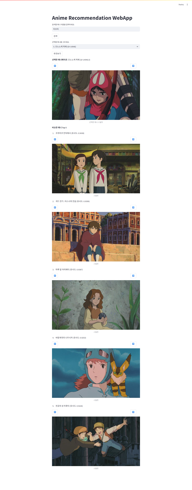
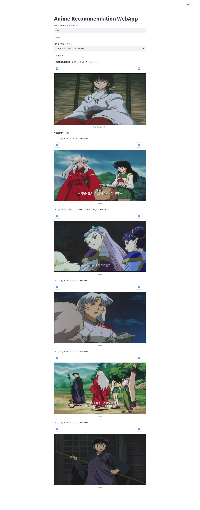
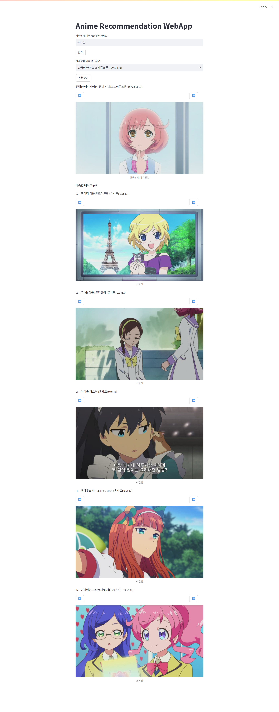

# similar-style-ani
이 프로젝트는 Measuring Style Similarity Model로 애니메이션 그림체의 유사성을 계산한 뒤 그림체가 유사한 애니메이션을 추천해주는 웹입니다.

## 사용방법
1.   git clone https://github.com/millstar324/similar-style-ani.git
2.   cd similar-style-ani
3.   docker build -t similar-style-ani .
4.   docker run -p 8501:8501 similar-style-ani

터미널에 위 순서대로 코드를 실행하고 http://localhost:8501에 접속하면 해당 프로그램을 사용해 보실 수 있습니다.

## 예시

